# Example Docker Compose project for Telegraf, InfluxDB and Grafana

Це приклад деплою проекту з моніторингом в TIG-стеку (Telegraf, InfluxDB and Grafana).

Моніторинг-інфраструктура написана поверх одного вебсайту, знайденого на гітхабі, який дозволяє шукати дані про фільми з IMDB.
Написаний він був дуже криво, та і пізніше я зрозумів, що було помилкою обирати такий проект, бо він занадто тяжкий і його складно делпоїти та локально нагружати. Але вже як є :). Тож, тут використовуються:
    - mongo (для зберігання користувачів)
    - elastic (для пошуку по назві фільму)
    - redis (для кешування сесій і тп)

Щоб не заспамити вас скріншотами, додам тільки основні по різним типам нагрузки.

## Деплой

```sh
docker-compose build
docker-compose up -d
```

## Тестування

Перш за все, я запустив ряд простих запитів на головну сторінку, і, як бачимо, CPU usage вже досить високий, бо проект був запущений всього на 4 virtual cpu + 6gb ram.

```sh
siege -c20 -t20S 'http://localhost:80'
```

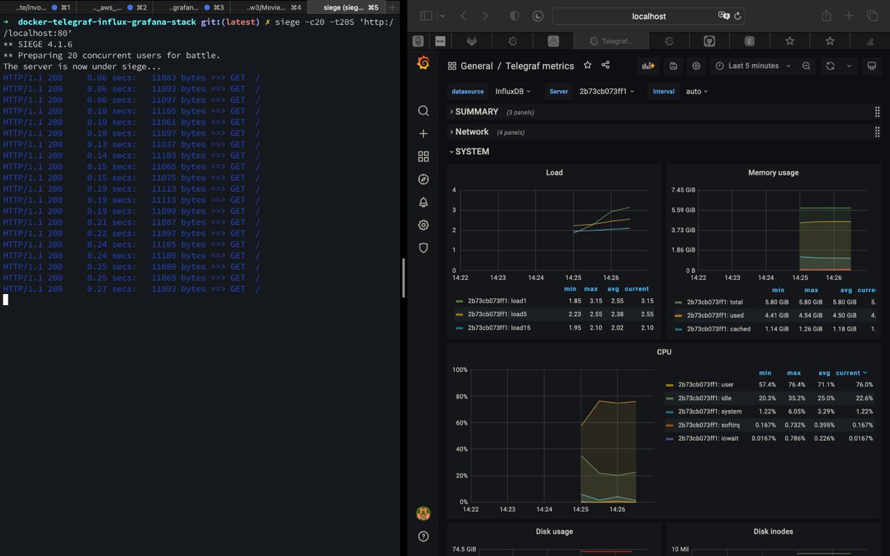
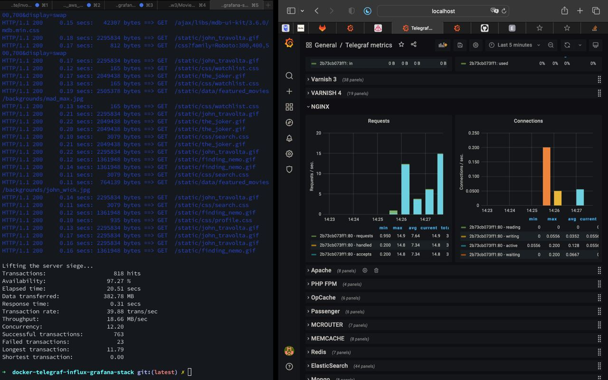

Трішки збільшимо навантаження

```sh
siege -c100 -t20S 'http://localhost:80'
```

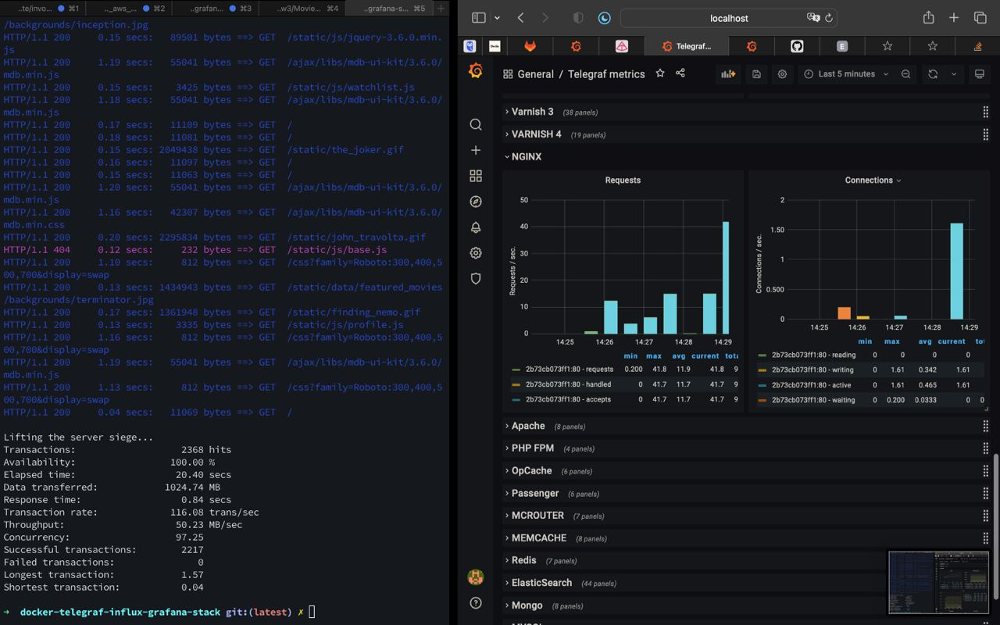
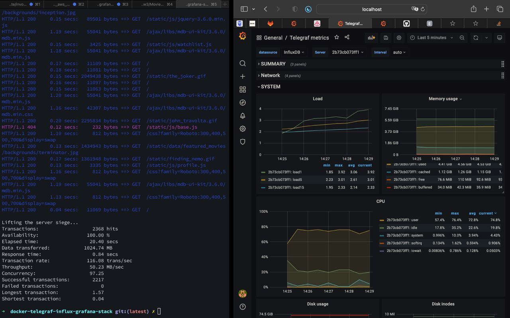

Під час навантаження можна побачити як зростає network usage:

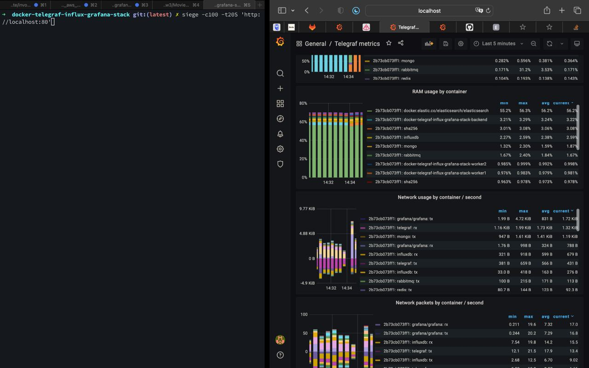
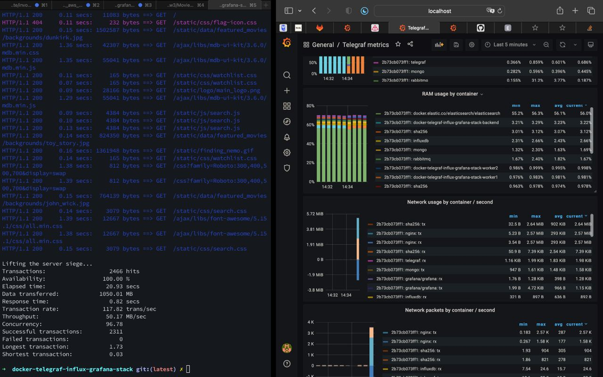

Автор оригінального репозиторію пропонує запустити команду, яка стягне впише дані з IMDB у mongo + redis

```sh
docker-compose exec main python init_db.py
```

Спочатку дані заносяться в монгу, потім в еластік. На скрінах ми можемо явно спостерігати їх навантаження, а особливо – великий LA при записах в еластік та спад CPU usage після виключення запису.

Монга:
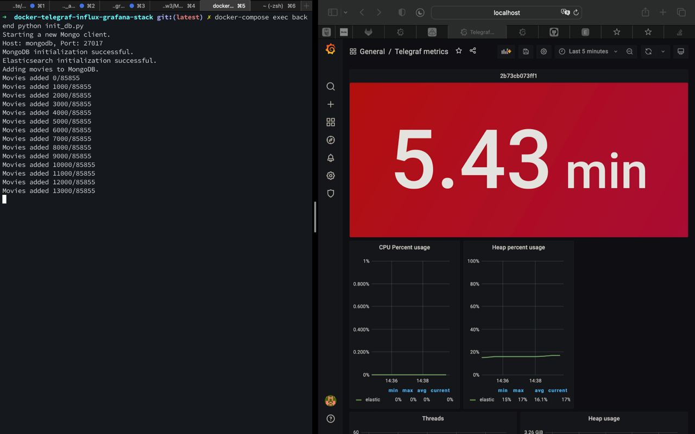
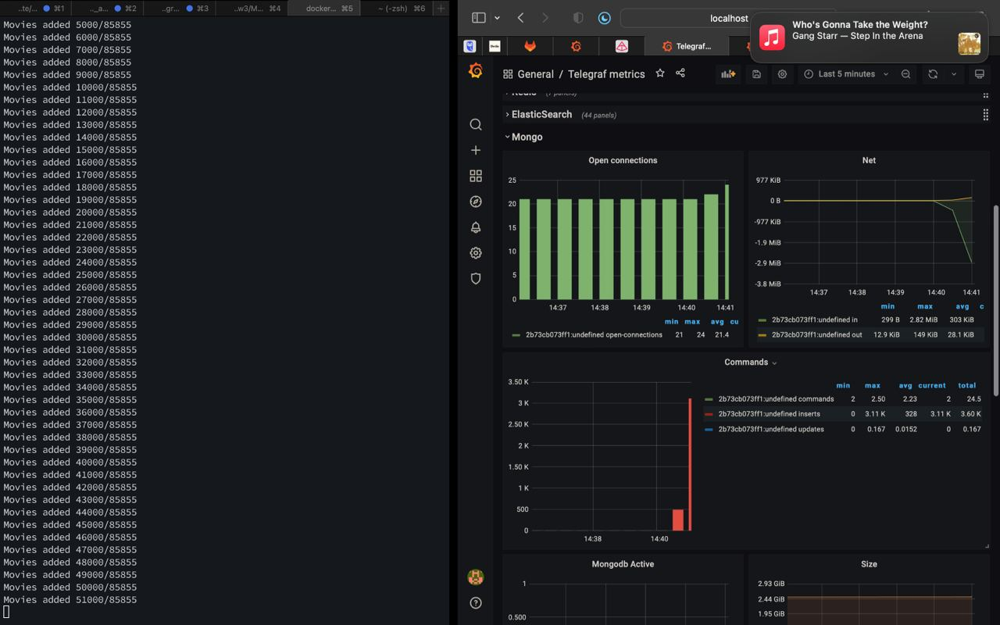

Еластік (виріс LA на час запису):
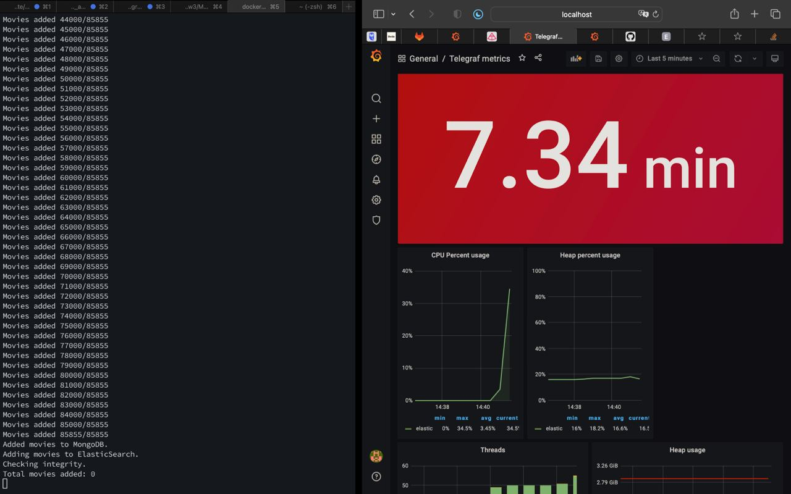
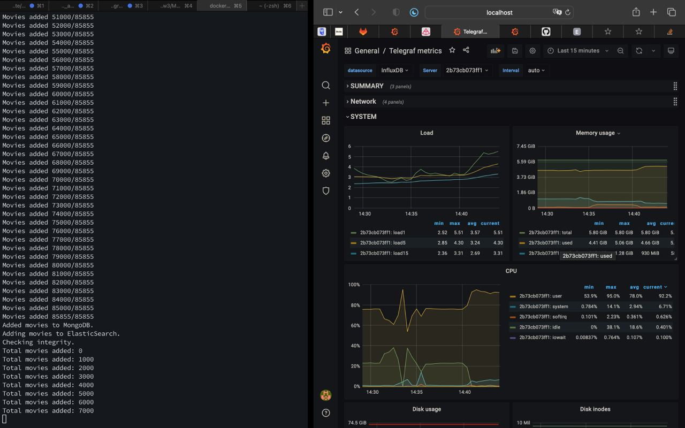
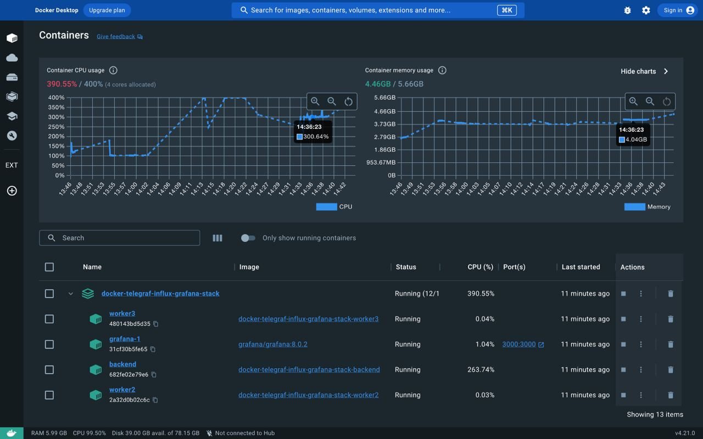
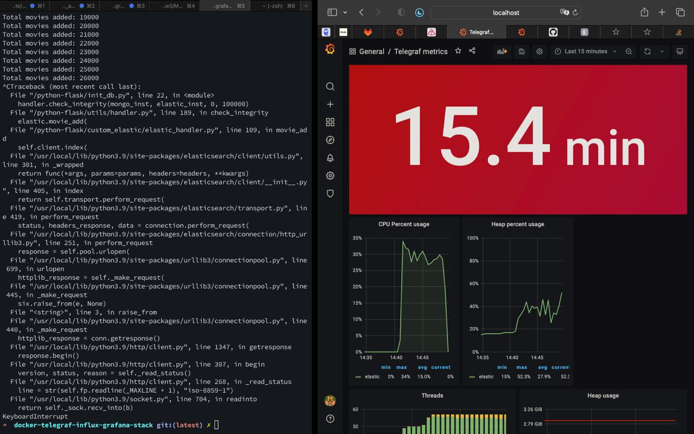

Потім тестував пошук в еластіку.

Аплікуха написана так, що вона раз на секунду (або 3 рази на секунду, через трьох воркерів) перевіряє чергу чи вже готові результати пошуку. Через це, пошук є дуже довгим та виконується за незадовільний час:

```sh
siege -c25 -t60S 'http://localhost:80/process-search POST search_str=blade' --no-parser
```

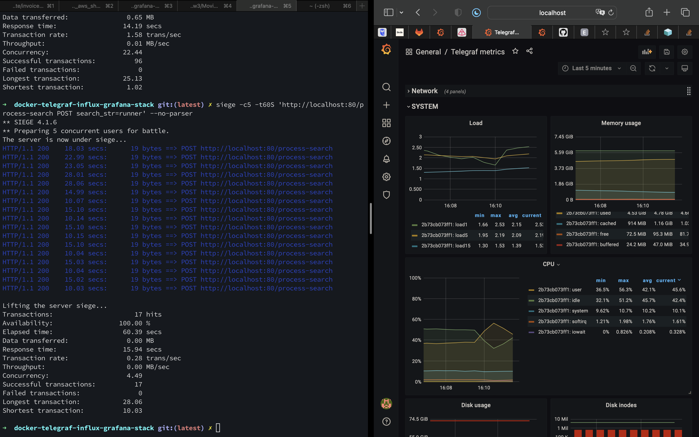
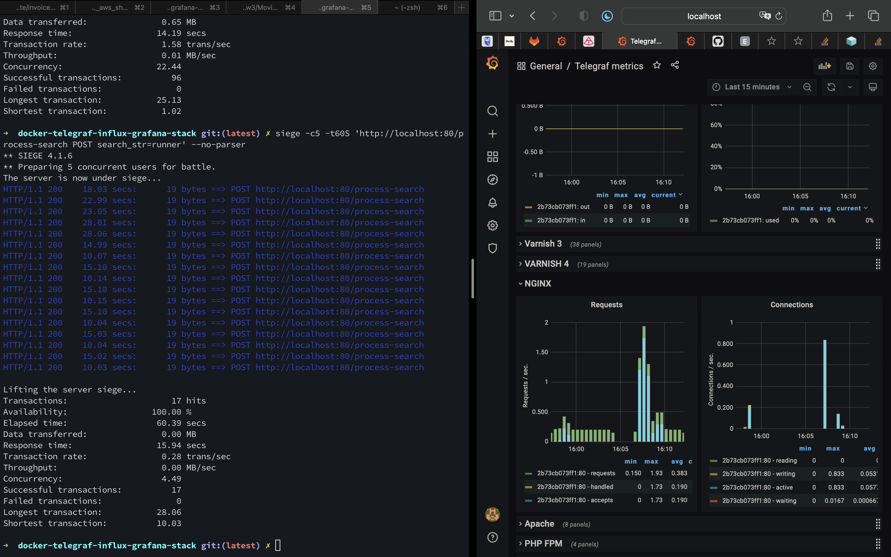

Проста спроба знизити цей таймаут до 0.1 секунди призвела до того, що окремі треди backend (аплікейшн-серверу)почали падати через недостачу ресурсів (OOM):

```log
2023-07-07 15:59:11 [2023-07-07 13:59:11 +0000] [1] [WARNING] Worker with pid 56 was terminated due to signal 9
2023-07-07 15:59:11 [2023-07-07 13:59:11 +0000] [84] [INFO] Booting worker with pid: 84
2023-07-07 15:59:11 [2023-07-07 13:59:11 +0000] [1] [WARNING] Worker with pid 60 was terminated due to signal 9
2023-07-07 15:59:11 [2023-07-07 13:59:11 +0000] [85] [INFO] Booting worker with pid: 85
```

Доречі, можна побачити, як зростала кількість меседжів в черзі (не впевнений, чи вони коректно чистяться тим проектом):

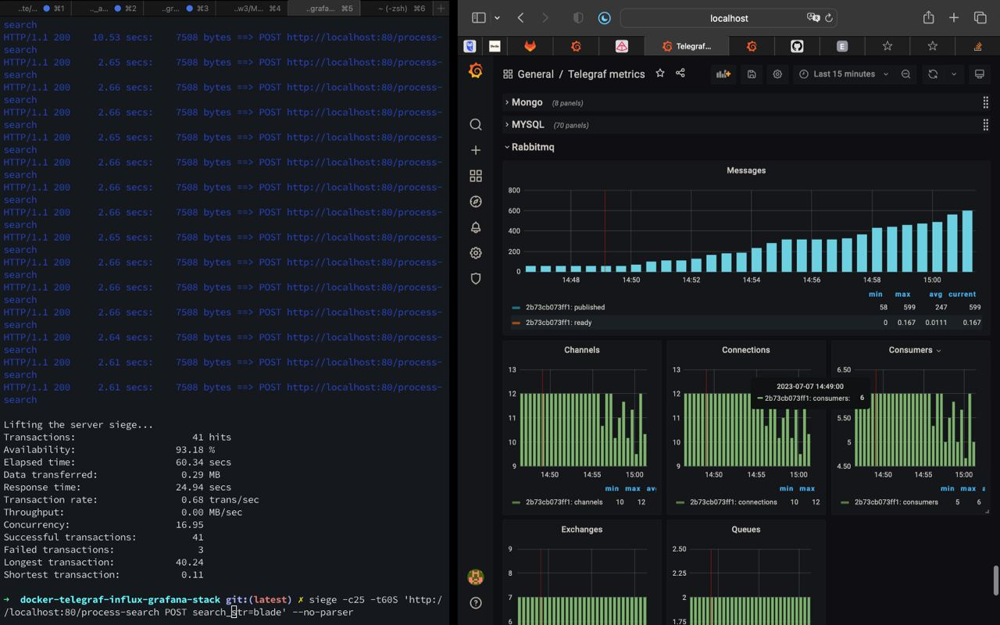

Міг би ще додати всього, але здається що і так багацько і сумбурно. Але те, що моніторинг відповідає дійсності я перевірив :)
Наступного разу додам малесенький проект, який простіше тестувати і грузити. Дякую.
